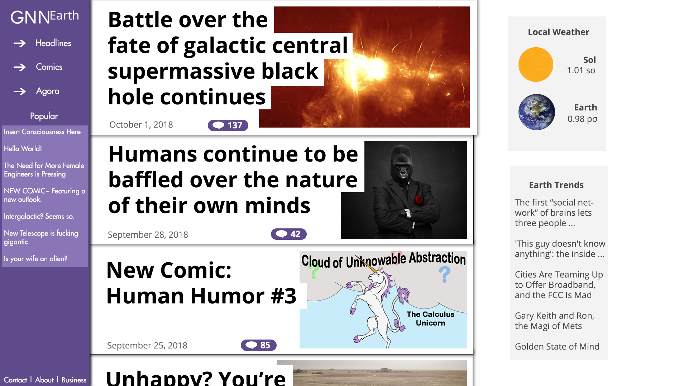

# GNN-Earth

### Objective:

Construct a news-media website in which the world's top headlines are reported on from the perspective of a highly indifferent
advanced alien civilization. Site must include a full fledged content management system in which contributors may generate
articles, comics, and discussion topics for the user-base. In addition to the above the users will be able to register user
accounts and may interact with the site via content comments and a limited discussion board.

### UI Mockups:
* Initial design Schema:

* Current UI Implementation:

### Design Principles:
* Mobile-first: Site must fully support display on mobile phone screens with all the same functionality as the desktop
from the same codebase.
* Single Page Application: Site will utilize modern single page application principles; index.php in final implementation
will serve as a dynamic routing table from which requested data is served dynamically by the application codebase.
* 100% Vanilla: Anything that can be done with jQuery can be done with "vanilla Javascript". Anything that can be done
with Laravel can be done with "vanilla PHP". Anuthing that can be done with Bootstrap can be done with vanilla HTML/CSS. In order
to maintain the smallest possible code-base (reducing load time and server burden) no frameworks, templating engines, or
tooling beyond what is listed in tooling section will be used.
* Bobby's Wired-In-Design: UI will be designed to reduce the time between a user wanting to access a particular
component of the application and utilizing that component to the smallest possible value. Design will be "wired-in", 
that is using the site will make the user feel as though they are plugged in to humanity's common central nervous system.

### Validation:
* **HTML Validator:**  [validator.w3.org](validator.w3.org)
* **CSS Validator:** [jigsaw.w3.org/css-validator](jigsaw.w3.org/css-validator)

###Tooling:
* Apache 2.4.34
* MariaDB 10.1.36
* PHP 7.2.10
* phpMyAdmin 4.8.3

### Testing:
At present testing using tooling cited above on Windows 10 and Ubuntu (UNCW Satoshi). Planning to deploy on Ubuntu 18.04 LTS
with tooling used in development. Testing scripts for attempting to circumvent security measures or allowing the user to
perform unauthorized interactions, as well as testing the server-burden of the site will be stored in /test.

## Contributors:

* **Bobby Palmer** - *Sole Contributor* - [of20thmaine](https://github.com/of20thmaine)

## License

This project is currently unlicensed.
